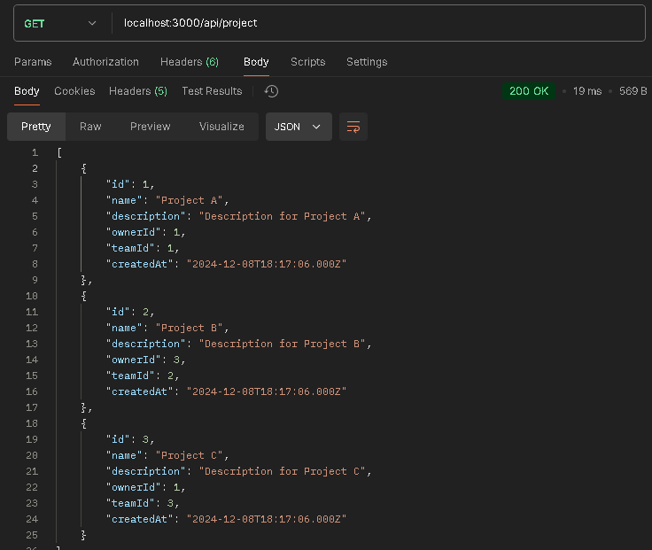
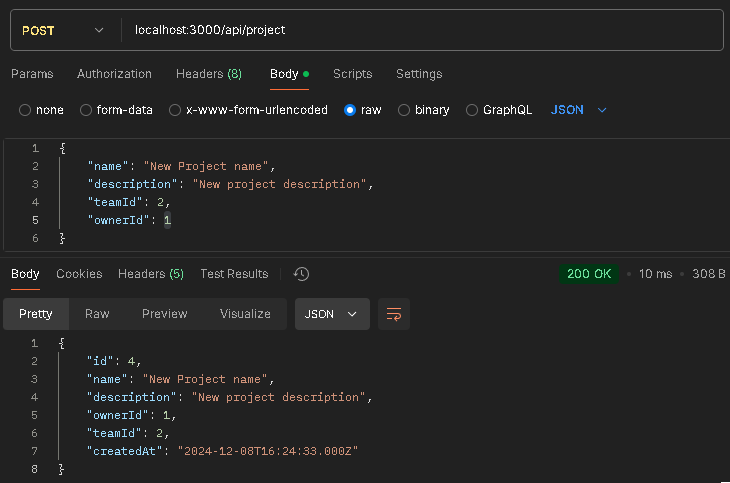
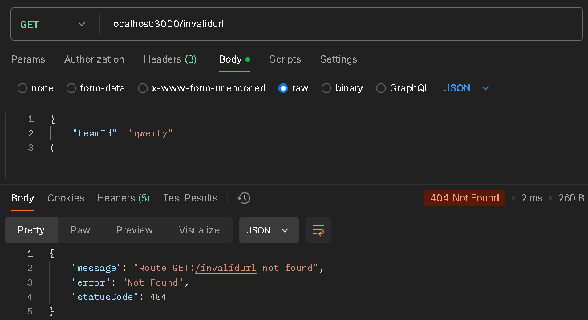
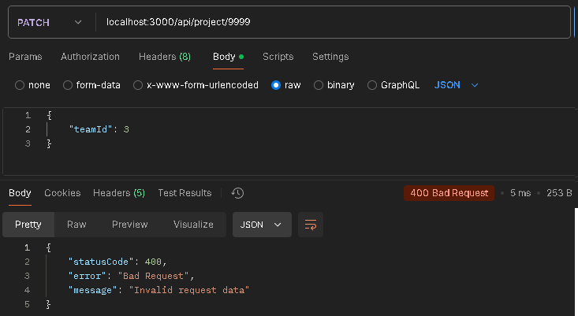

# Тестування працездатності системи

Тестування відбувається за допомогою сервісу POSTMAN.

## GET /project

## GET /project/:id

## PATCH /project/:id

## POST /project/

## DELETE /project/:id

# Обробка винятків

## 404 status code

## Invalid body request

## Invalid url

## Patch request with invalid id

## Non integer id

